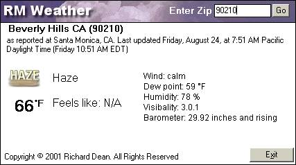



## RMWeather

### Description

This program will grab the Weather from Weather.Com by using a free 3rd party component by Softshell Solutions - http://www.softshell.net/asp/cp/weather.asp
 
### More Info
 
Zip Code

Before using this code, you must copy the s3weather.dll to your Windows/System Folder then register it.

Weather Information

             |
---                |---
**Submitted On**   |2001-08-29 08:29:30
**By**             |[r\_mdean](https://github.com/Planet-Source-Code/PSCIndex/blob/master/ByAuthor/r-mdean.md)
**Level**          |Advanced
**User Rating**    |5.0 (15 globes from 3 users)
**Compatibility**  |VB 6\.0
**Category**       |[Miscellaneous](https://github.com/Planet-Source-Code/PSCIndex/blob/master/ByCategory/miscellaneous__1-1.md)
**World**          |[Visual Basic](https://github.com/Planet-Source-Code/PSCIndex/blob/master/ByWorld/visual-basic.md)
**Archive File**   |[RMWeather26040972001\.zip](https://github.com/Planet-Source-Code/r-mdean-rmweather__1-26773/archive/master.zip)

